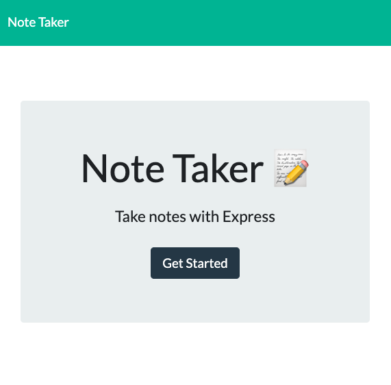

# Note-Taker

## About

Note-Taker is a web application that stores a user's notes. To run Note-Taker, launch your CLI, navigate to the Note-Taker root directory, type `nodemon server`, then navigate to http://localhost:3001/ in your browser.

## Screenshot

